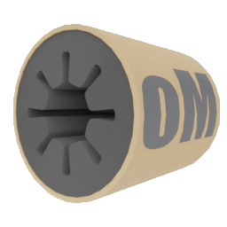

openMotor
==========


Overview
--------
openMotor is an open-source internal ballistics simulator for rocket motor experimenters. The software estimates a rocket motor's chamber pressure and thrust based on propellant properties, grain geometry, and nozzle specifications. It uses the Fast Marching Method to determine how a propellant grain regresses, which allows the use of arbitrary core geometries.

Current Features:
* Metric and imperial units
* Support for common grain geometries such as BATES, Finocyl, Star and more
* Loading custom grain geometry from DXF files
* A propellant editor that allows the user to enter the properties of as many propellants as they wish
* The grain editor displays how a grain will regress to cut down on the guesswork involved in tweaking geometry
* ENG file exporting
* Burnsim importing and exporting
* A UI that supports saving and loading designs along with undo and redo

Planned Features:
* Erosive burning simulation - The subject of this branch
* Detailed output of every calculated parameter at any time and position along the motor
* Tapered-core grains

The calculations involved were sourced from Rocket Propulsion Elements by George Sutton and from [Richard Nakka's website](https://www.nakka-rocketry.net/rtheory.html).


Download
-------
The easiest way to use openMotor is to navigate to the 'releases' sidebar, click 'latest', and download the version for your system. From there, just unzip the file and run it. Alternatively, you can run it from source code to get the latest features. 

Building from Source
--------------------
The program is currently being developed using python 3.8. The dependencies are outlined in `requirements.txt`, the main ones include `PyQt5`, `matplot`, `numpy`, `scipy`, `scikit-fmm`, and `scikit-image`. Because the PyQt5 bindings are used for the GUI, Qt5 must also be installed.

The easiest way to build/run from source code is to clone the repository and install the required dependencies into a virtual environment:
```
[LINUX]
$ git clone https://github.com/reilleya/openMotor
$ cd openMotor
$ python3 -m venv .venv
$ source .venv/bin/activate
$ pip install -r requirements.txt
```
```
[Windows Powershell]
Open powershell prompt in main folder once cloned
$ py -m venv .venv
$ .venv/scripts/activate
$ pip install -r requirements.txt
```
If you are using a version of python that does not have a prebuilt version of one of the dependencies, the `pip` command above might fail with an error like:
```
Failed building wheel for scikit-fmm
skfmm/fmm.cpp:4:10: fatal error: Python.h: No such file or directory
```
The fix is to install `python3-dev` or the equivalent with your system package manager.

#### UI Files:
openMotor uses Qt Designer to lay out the GUI, which generates `.ui` files describing the user interface. 
We use `pyuic5` to compile these files into Python source code which is then included in the program as ordinary source code.

Because these autogenerated files are not committed to the source tree, you must build them by running:
```
$ python setup.py build_ui
```
Note that if you make changes to the UI using the `.ui` forms, you must re-build using the same command.

Once everything is set up, you can start openMotor by running: `python main.py`
###### Note: On some systems, Python 2 and 3 are installed simultaneously, so you may have to specify which version to run when creating the venv. After the venv has been activated, the programs `python` and `pip` are aliased to the python runtime specific for your venv, so use those (instead of `pip3` and `python3`, on e.g. Debian Linux)

Data Files
-----------
openMotor uses [YAML](https://en.wikipedia.org/wiki/YAML) for data storage. Motor files have the extension `.ric` to differentiate them, but internally they are YAML and can be edited in a text editor if desired. The recommended MIME type for these files is `application/vnd.openmotor+yaml`.

The remaining user information, like propellant data and preferences, is stored in plain YAML files in ~~`<AppData>\Local\openMotor` on Windows, `/Users/<username>/Library/Application Support/openMotor` on Mac OS, and `/home/<username>/.local/share/openMotor` on Linux.~~ I can't find it there! Found mine under `local/packages/PythonSoftwareFoundation.blahblahblah/LocalCache/Local/OpenMotor/OpenMotor on Win 10. 

License
-------
openMotor is released under the GNU GPL v3 license. The source code is distributed so you can build cool stuff with it, and so you don't have to trust the calculations are being done correctly. Check for yourself (and file an issue ticket!) if you doubt the results.

Contributing
------------
As openMotor is open source, one of the goals of the project is to have as many eyes on the code as possible. I believe this is the best way to avoid bugs and also the easiest way to get new features added to the software. If you have ideas on how to improve the program or find an error, please open an issue ticket for discussion or file a pull request if possible.
